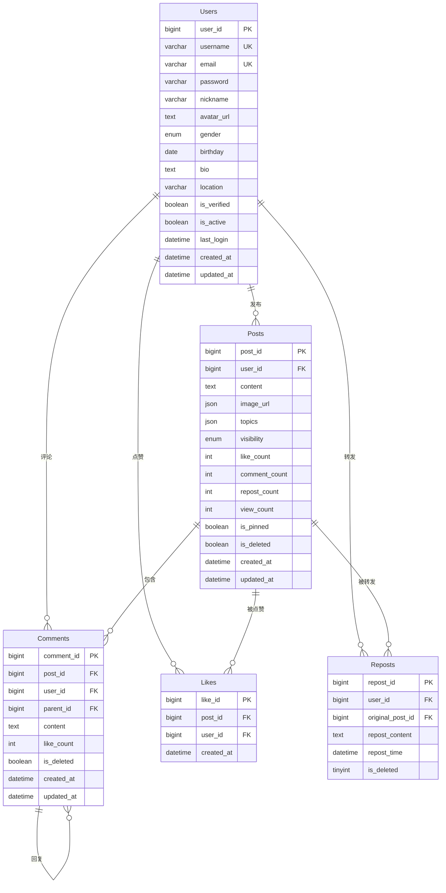
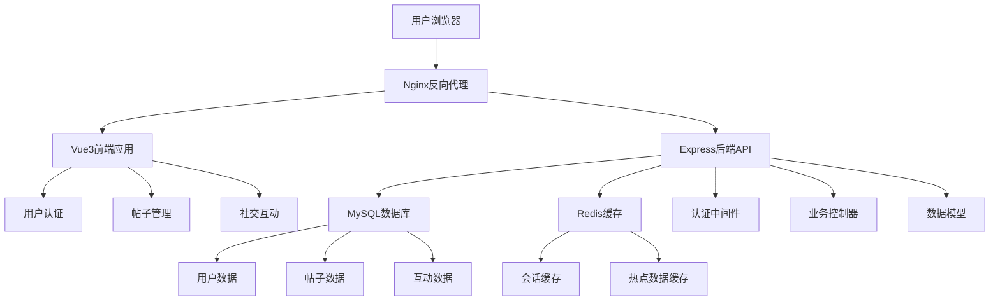
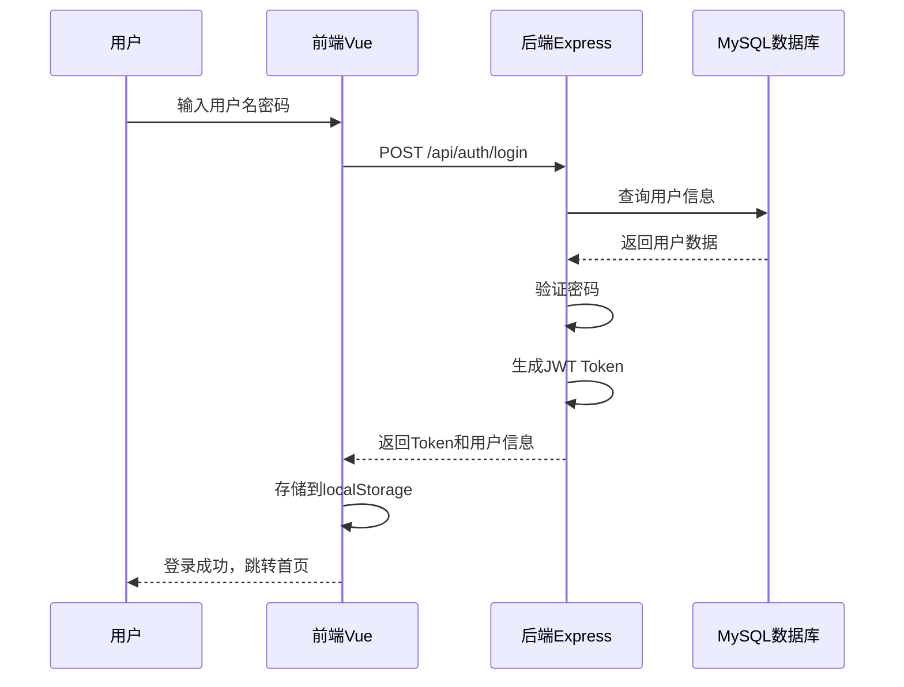
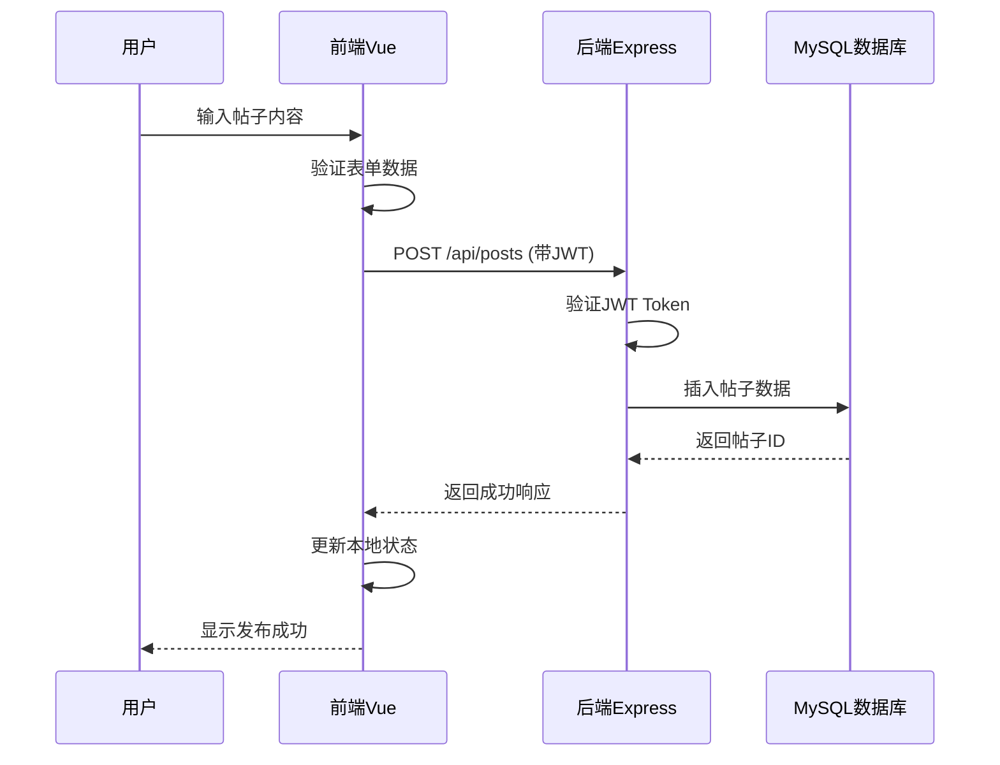
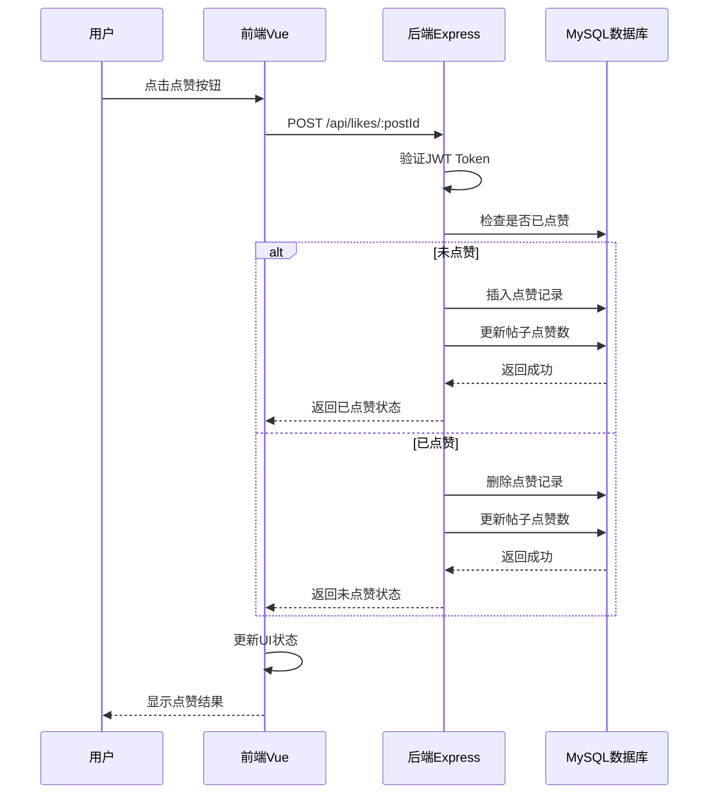
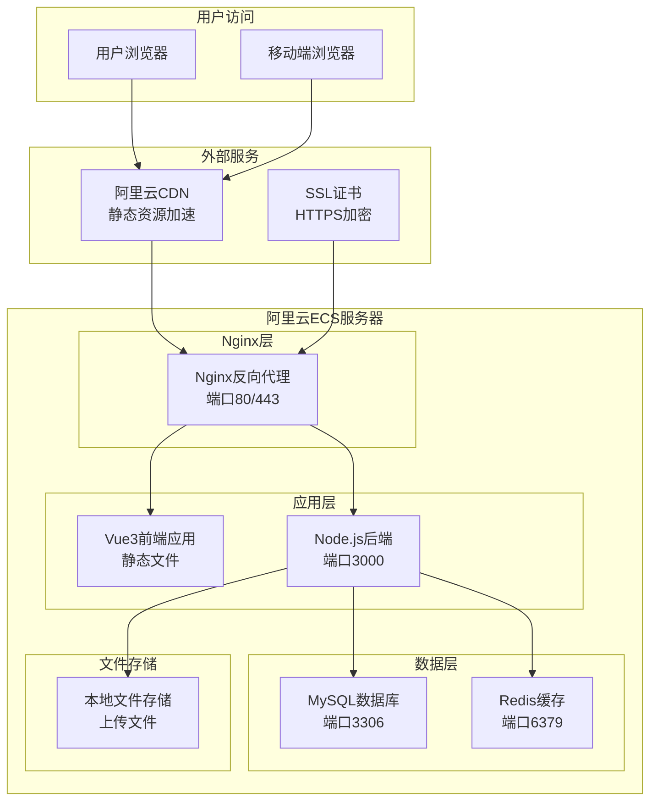
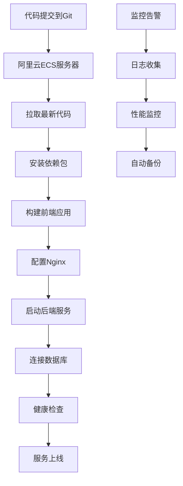
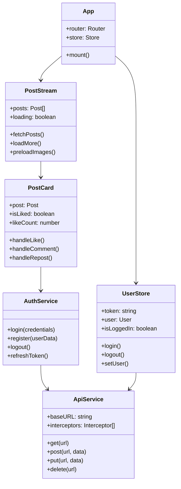
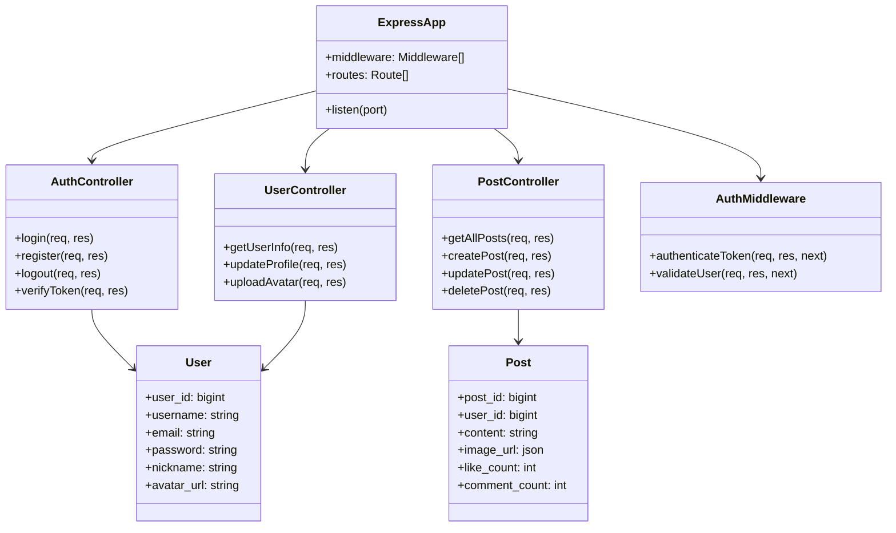

# Ufulano.cn 社交平台 - 项目设计文档

## 📋 项目概述

**Ufulano.cn** 是一个基于现代Web技术栈构建的社交平台项目，采用前后端分离架构，实现了完整的用户系统、内容管理、社交互动等功能。项目展示了全栈开发能力，具备企业级应用的技术水准。

### 🎯 技术栈

#### 前端技术
- **Vue 3** + **Composition API** - 现代化响应式框架
- **Element Plus** - 企业级UI组件库
- **Pinia** - Vue 3官方状态管理库
- **Vue Router** - 单页面应用路由管理
- **Axios** - HTTP客户端库
- **Vite** - 现代化构建工具

#### 后端技术
- **Node.js** + **Express.js** - 服务端运行环境和Web框架
- **Sequelize** - Node.js ORM数据库工具
- **MySQL 8.0** - 关系型数据库
- **JWT** - JSON Web Token身份认证
- **bcryptjs** - 密码加密库
- **Swagger** - API文档生成工具

## 🏗️ 项目架构

### 前端架构
```
client/src/
├── components/          # 可复用组件
│   ├── AppHeader.vue   # 应用头部
│   ├── PostCard.vue    # 帖子卡片
│   ├── RepostCard.vue  # 转发卡片
│   ├── PostStream.vue  # 帖子流
│   ├── UserSidebar.vue # 用户侧边栏
│   └── ...
├── views/              # 页面组件
│   ├── Home.vue        # 首页
│   ├── Login.vue       # 登录页
│   ├── Register.vue    # 注册页
│   ├── PostDetail.vue  # 帖子详情
│   └── UserProfile.vue # 用户主页
├── api/                # API接口封装
├── store/              # 状态管理
├── router/             # 路由配置
└── utils/              # 工具函数
```

### 后端架构
```
server/src/
├── controllers/        # 控制器层
│   ├── authController.js    # 认证控制器
│   ├── postController.js   # 帖子控制器
│   ├── userController.js   # 用户控制器
│   ├── commentController.js # 评论控制器
│   ├── likeController.js   # 点赞控制器
│   └── repostController.js # 转发控制器
├── models/             # 数据模型
│   ├── User.js         # 用户模型
│   ├── Post.js         # 帖子模型
│   ├── Comment.js      # 评论模型
│   ├── Like.js         # 点赞模型
│   └── Repost.js       # 转发模型
├── routes/             # 路由定义
├── middleware/         # 中间件
├── config/             # 配置文件
└── utils/              # 工具函数
```

## 🔧 核心功能实现

### 1. 用户认证系统

#### 功能特性
- **用户注册/登录** - 支持用户名和邮箱注册
- **JWT身份认证** - 无状态Token认证机制
- **密码加密** - 使用bcryptjs进行密码哈希
- **记住我功能** - 支持长期登录状态保持
- **自动登录** - 页面刷新后自动恢复登录状态

#### 技术实现
```javascript
// 用户状态管理 (Pinia Store)
export const useUserStore = defineStore('user', {
  state: () => ({
    token: '',
    user: null,
    rememberMe: false,
    tokenExpiry: null
  }),
  
  getters: {
    isLoggedIn: (state) => !!state.token && !!state.user,
    displayName: (state) => state.user?.nickname || state.user?.username || '未知用户'
  },
  
  actions: {
    setUser(token, user, rememberMe = false) {
      this.token = token
      this.user = user
      this.rememberMe = rememberMe
      this.saveToStorage()
    }
  }
})
```

#### 数据库设计
```sql
-- 用户表结构
CREATE TABLE Users (
  user_id BIGINT PRIMARY KEY AUTO_INCREMENT,
  username VARCHAR(50) NOT NULL,
  email VARCHAR(100) NOT NULL,
  password VARCHAR(100) NOT NULL,
  nickname VARCHAR(50),
  avatar_url TEXT,
  bio TEXT,
  location VARCHAR(100),
  gender ENUM('Male', 'Female', 'Other'),
  birthday DATE,
  create_time DATETIME DEFAULT CURRENT_TIMESTAMP,
  update_time DATETIME DEFAULT CURRENT_TIMESTAMP ON UPDATE CURRENT_TIMESTAMP
);
```

### 2. 帖子管理系统

#### 功能特性
- **帖子发布** - 支持文字、图片内容发布
- **图片上传** - 支持多图片上传和显示
- **内容编辑** - 支持帖子内容修改
- **软删除** - 支持帖子软删除机制
- **分页查询** - 高性能的分页加载
- **搜索功能** - 支持帖子内容搜索

#### 技术实现
```javascript
// 帖子数据模型
class Post extends Model {}
Post.init({
  post_id: {
    type: DataTypes.BIGINT,
    primaryKey: true,
    autoIncrement: true,
  },
  user_id: {
    type: DataTypes.BIGINT,
    allowNull: false,
    references: { model: 'Users', key: 'user_id' }
  },
  content: {
    type: DataTypes.TEXT,
    allowNull: true,
    collate: 'utf8mb4_general_ci'
  },
  image_url: {
    type: DataTypes.TEXT('long'),
    allowNull: true,
    comment: '图片数据，使用LONGTEXT类型存储'
  },
  like_count: {
    type: DataTypes.INTEGER,
    defaultValue: 0
  },
  comment_count: {
    type: DataTypes.INTEGER,
    defaultValue: 0
  },
  repost_count: {
    type: DataTypes.INTEGER,
    defaultValue: 0
  }
}, { sequelize, modelName: 'Post', tableName: 'Posts' })
```

### 3. 点赞系统

#### 功能特性
- **点赞/取消点赞** - 支持帖子点赞操作
- **防重复点赞** - 数据库唯一约束防止重复
- **实时计数** - 点赞数量实时更新
- **状态同步** - 前端状态与后端数据同步
- **批量查询** - 支持批量获取点赞状态

#### 数据库设计
```sql
-- 点赞表结构
CREATE TABLE Likes (
  like_id BIGINT PRIMARY KEY AUTO_INCREMENT,
  user_id BIGINT NOT NULL,
  post_id BIGINT NOT NULL,
  like_time DATETIME DEFAULT CURRENT_TIMESTAMP,
  UNIQUE KEY unique_user_post_like (user_id, post_id),
  FOREIGN KEY (user_id) REFERENCES Users(user_id) ON DELETE CASCADE,
  FOREIGN KEY (post_id) REFERENCES Posts(post_id) ON DELETE CASCADE
);
```

### 4. 转发系统

#### 功能特性
- **转发帖子** - 支持转发其他用户的帖子
- **转发评论** - 转发时可添加个人评论
- **转发链显示** - 类似微博的转发链展示
- **嵌套转发** - 支持多层转发结构
- **转发统计** - 转发数量统计和显示

#### 数据库设计
```sql
-- 转发表结构
CREATE TABLE Reposts (
  repost_id BIGINT PRIMARY KEY AUTO_INCREMENT,
  user_id BIGINT NOT NULL,
  original_post_id BIGINT NOT NULL,
  repost_content TEXT NULL,
  repost_time DATETIME DEFAULT CURRENT_TIMESTAMP,
  is_deleted TINYINT(1) DEFAULT 0,
  FOREIGN KEY (user_id) REFERENCES Users(user_id) ON DELETE CASCADE,
  FOREIGN KEY (original_post_id) REFERENCES Posts(post_id) ON DELETE CASCADE
);
```

### 5. 评论系统

#### 功能特性
- **评论发布** - 支持对帖子进行评论
- **嵌套评论** - 支持评论的回复功能
- **表情支持** - 支持表情符号输入
- **评论管理** - 支持评论编辑和删除
- **实时更新** - 评论数量实时统计

#### 数据库设计
```sql
-- 评论表结构
CREATE TABLE Comments (
  comment_id BIGINT PRIMARY KEY AUTO_INCREMENT,
  post_id BIGINT NOT NULL,
  user_id BIGINT NOT NULL,
  parent_id BIGINT,
  content TEXT NOT NULL,
  like_count INT DEFAULT 0,
  is_deleted BOOLEAN DEFAULT FALSE,
  created_at DATETIME DEFAULT CURRENT_TIMESTAMP,
  updated_at DATETIME DEFAULT CURRENT_TIMESTAMP ON UPDATE CURRENT_TIMESTAMP,
  FOREIGN KEY (post_id) REFERENCES Posts(post_id) ON DELETE CASCADE,
  FOREIGN KEY (user_id) REFERENCES Users(user_id) ON DELETE CASCADE,
  FOREIGN KEY (parent_id) REFERENCES Comments(comment_id) ON DELETE CASCADE
);
```

## 🗄️ 数据库设计

### 完整数据库表结构

#### 1. Users 表 - 用户信息
```sql
CREATE TABLE Users (
  user_id BIGINT PRIMARY KEY AUTO_INCREMENT COMMENT '用户ID',
  username VARCHAR(50) UNIQUE NOT NULL COMMENT '用户名',
  email VARCHAR(100) UNIQUE NOT NULL COMMENT '邮箱',
  password VARCHAR(100) NOT NULL COMMENT '密码(加密)',
  nickname VARCHAR(50) COMMENT '昵称',
  avatar_url TEXT COMMENT '头像URL',
  gender ENUM('Male', 'Female', 'Other') COMMENT '性别',
  birthday DATE COMMENT '生日',
  bio TEXT COMMENT '个人简介',
  location VARCHAR(100) COMMENT '所在地',
  is_verified BOOLEAN DEFAULT FALSE COMMENT '是否认证',
  is_active BOOLEAN DEFAULT TRUE COMMENT '是否激活',
  last_login DATETIME COMMENT '最后登录时间',
  created_at DATETIME DEFAULT CURRENT_TIMESTAMP COMMENT '创建时间',
  updated_at DATETIME DEFAULT CURRENT_TIMESTAMP ON UPDATE CURRENT_TIMESTAMP COMMENT '更新时间',
  INDEX idx_username (username),
  INDEX idx_email (email),
  INDEX idx_created_at (created_at)
) ENGINE=InnoDB DEFAULT CHARSET=utf8mb4 COLLATE=utf8mb4_unicode_ci COMMENT='用户表';
```

#### 2. Posts 表 - 帖子信息
```sql
CREATE TABLE Posts (
  post_id BIGINT PRIMARY KEY AUTO_INCREMENT COMMENT '帖子ID',
  user_id BIGINT NOT NULL COMMENT '发布用户ID',
  content TEXT NOT NULL COMMENT '帖子内容',
  image_url JSON COMMENT '图片URL数组',
  topics JSON COMMENT '话题标签数组',
  visibility ENUM('public', 'private', 'friends') DEFAULT 'public' COMMENT '可见性',
  like_count INT DEFAULT 0 COMMENT '点赞数',
  comment_count INT DEFAULT 0 COMMENT '评论数',
  repost_count INT DEFAULT 0 COMMENT '转发数',
  view_count INT DEFAULT 0 COMMENT '浏览数',
  is_pinned BOOLEAN DEFAULT FALSE COMMENT '是否置顶',
  is_deleted BOOLEAN DEFAULT FALSE COMMENT '是否删除',
  created_at DATETIME DEFAULT CURRENT_TIMESTAMP COMMENT '创建时间',
  updated_at DATETIME DEFAULT CURRENT_TIMESTAMP ON UPDATE CURRENT_TIMESTAMP COMMENT '更新时间',
  FOREIGN KEY (user_id) REFERENCES Users(user_id) ON DELETE CASCADE,
  INDEX idx_user_id (user_id),
  INDEX idx_created_at (created_at),
  INDEX idx_visibility (visibility),
  FULLTEXT idx_content (content)
) ENGINE=InnoDB DEFAULT CHARSET=utf8mb4 COLLATE=utf8mb4_unicode_ci COMMENT='帖子表';
```

#### 3. Comments 表 - 评论信息
```sql
CREATE TABLE Comments (
  comment_id BIGINT PRIMARY KEY AUTO_INCREMENT COMMENT '评论ID',
  post_id BIGINT NOT NULL COMMENT '帖子ID',
  user_id BIGINT NOT NULL COMMENT '评论用户ID',
  parent_id BIGINT COMMENT '父评论ID(回复)',
  content TEXT NOT NULL COMMENT '评论内容',
  like_count INT DEFAULT 0 COMMENT '点赞数',
  is_deleted BOOLEAN DEFAULT FALSE COMMENT '是否删除',
  created_at DATETIME DEFAULT CURRENT_TIMESTAMP COMMENT '创建时间',
  updated_at DATETIME DEFAULT CURRENT_TIMESTAMP ON UPDATE CURRENT_TIMESTAMP COMMENT '更新时间',
  FOREIGN KEY (post_id) REFERENCES Posts(post_id) ON DELETE CASCADE,
  FOREIGN KEY (user_id) REFERENCES Users(user_id) ON DELETE CASCADE,
  FOREIGN KEY (parent_id) REFERENCES Comments(comment_id) ON DELETE CASCADE,
  INDEX idx_post_id (post_id),
  INDEX idx_user_id (user_id),
  INDEX idx_parent_id (parent_id),
  INDEX idx_created_at (created_at)
) ENGINE=InnoDB DEFAULT CHARSET=utf8mb4 COLLATE=utf8mb4_unicode_ci COMMENT='评论表';
```

#### 4. Likes 表 - 点赞信息
```sql
CREATE TABLE Likes (
  like_id BIGINT PRIMARY KEY AUTO_INCREMENT COMMENT '点赞ID',
  post_id BIGINT NOT NULL COMMENT '帖子ID',
  user_id BIGINT NOT NULL COMMENT '点赞用户ID',
  created_at DATETIME DEFAULT CURRENT_TIMESTAMP COMMENT '点赞时间',
  FOREIGN KEY (post_id) REFERENCES Posts(post_id) ON DELETE CASCADE,
  FOREIGN KEY (user_id) REFERENCES Users(user_id) ON DELETE CASCADE,
  UNIQUE KEY unique_post_user (post_id, user_id),
  INDEX idx_post_id (post_id),
  INDEX idx_user_id (user_id)
) ENGINE=InnoDB DEFAULT CHARSET=utf8mb4 COLLATE=utf8mb4_unicode_ci COMMENT='点赞表';
```

#### 5. Reposts 表 - 转发信息
```sql
CREATE TABLE Reposts (
  repost_id BIGINT PRIMARY KEY AUTO_INCREMENT COMMENT '转发ID',
  user_id BIGINT NOT NULL COMMENT '转发用户ID',
  original_post_id BIGINT NOT NULL COMMENT '原帖ID',
  repost_content TEXT COMMENT '转发内容',
  repost_time DATETIME NOT NULL DEFAULT CURRENT_TIMESTAMP COMMENT '转发时间',
  is_deleted TINYINT(1) NOT NULL DEFAULT 0 COMMENT '是否删除',
  FOREIGN KEY (user_id) REFERENCES Users(user_id) ON DELETE CASCADE,
  FOREIGN KEY (original_post_id) REFERENCES Posts(post_id) ON DELETE CASCADE,
  INDEX idx_user_id (user_id),
  INDEX idx_original_post_id (original_post_id),
  INDEX idx_repost_time (repost_time)
) ENGINE=InnoDB DEFAULT CHARSET=utf8mb4 COLLATE=utf8mb4_unicode_ci COMMENT='转发表';
```

### 数据库关系图



## 📊 系统架构图

### 整体架构流程图



### 用户认证时序图



### 帖子发布时序图



### 点赞功能时序图



## 🏗️ 部署架构图

### 阿里云部署架构



### 服务部署流程图



## 🏛️ 系统类图

### 前端组件类图



### 后端服务类图



## 📊 项目规模

### 文件结构
```
ufulano_cn/
├── client/                 # 前端应用
│   ├── src/
│   │   ├── components/    # 15个组件文件
│   │   ├── views/         # 7个页面文件
│   │   ├── api/           # 6个API文件
│   │   ├── store/         # 状态管理
│   │   ├── router/        # 路由配置
│   │   └── utils/         # 工具函数
│   └── package.json
├── server/                # 后端应用
│   ├── src/
│   │   ├── controllers/   # 6个控制器
│   │   ├── models/        # 5个数据模型
│   │   ├── routes/        # 6个路由文件
│   │   ├── middleware/    # 中间件
│   │   └── config/        # 配置文件
│   └── package.json
└── docs/                  # 项目文档
```

## 🔒 安全特性

### 认证安全
- **JWT Token认证** - 无状态身份验证
- **密码加密** - bcryptjs哈希加密
- **Token过期机制** - 自动过期和刷新
- **路由守卫** - 前端路由权限控制

### 数据安全
- **SQL注入防护** - Sequelize ORM参数化查询
- **XSS防护** - 输入输出过滤
- **CSRF防护** - 跨站请求伪造防护
- **文件上传安全** - 文件类型和大小限制

### 网络安全
- **CORS配置** - 跨域资源共享控制
- **请求验证** - 输入数据验证和过滤
- **错误处理** - 统一错误处理和日志记录

## 🚀 性能优化

### 前端优化
- **虚拟滚动** - VirtualPostList组件处理大量数据
- **图片懒加载** - LazyImage组件优化图片加载
- **组件缓存** - 合理使用Vue组件缓存
- **代码分割** - Vite构建工具代码分割

### 后端优化
- **数据库索引** - 关键字段建立索引
- **查询优化** - 优化SQL查询性能
- **分页查询** - 高效的分页数据加载
- **错误处理** - 完善的错误处理机制

### 缓存策略
- **本地存储** - localStorage用户状态持久化
- **图片缓存** - 图片加载缓存机制
- **状态管理** - Pinia状态持久化

## 📱 响应式设计

### 移动端适配
- **响应式布局** - 适配各种屏幕尺寸
- **触摸优化** - 移动端触摸交互优化
- **性能优化** - 移动端性能优化

### 用户体验
- **加载状态** - 完善的加载状态提示
- **错误反馈** - 友好的错误提示信息
- **操作反馈** - 及时的操作结果反馈

## 🛠️ 开发工具

### 前端工具
- **Vite** - 现代化构建工具
- **Vue DevTools** - Vue开发调试工具
- **Element Plus** - UI组件库
- **Axios** - HTTP请求库

### 后端工具
- **Express.js** - Web应用框架
- **Sequelize** - ORM数据库工具
- **Swagger** - API文档工具
- **JWT** - 身份认证工具

### 开发环境
- **Node.js 18+** - 运行环境
- **MySQL 8.0** - 数据库
- **Git** - 版本控制

## 🎯 技术亮点

### 1. 现代化技术栈
- 使用Vue 3 Composition API构建响应式界面
- 采用Pinia进行状态管理
- 基于Sequelize ORM的数据库操作
- JWT无状态认证机制

### 2. 组件化开发
- 高度复用的Vue组件设计
- 清晰的组件职责划分
- 良好的组件通信机制
- 统一的组件设计规范

### 3. 性能优化
- 虚拟滚动处理大量数据
- 图片懒加载优化加载性能
- 合理的缓存策略
- 数据库查询优化

### 4. 用户体验
- 响应式设计适配多设备
- 实时交互反馈
- 友好的错误处理
- 流畅的动画效果

### 5. 代码质量
- 统一的代码规范
- 完善的错误处理
- 详细的代码注释
- 模块化的代码结构

## 🔧 阿里云部署说明

### 服务器配置
- **ECS实例**: 2核4GB内存，40GB系统盘
- **操作系统**: Ubuntu 20.04 LTS
- **公网IP**: 已分配弹性公网IP
- **安全组**: 开放80、443、22、3000端口

### 环境要求
- Node.js 18.0+
- MySQL 8.0+
- Nginx 1.18+
- Redis 6.0+
- PM2 进程管理器

### 部署步骤

#### 1. 服务器环境准备
```bash
# 更新系统包
sudo apt update && sudo apt upgrade -y

# 安装Node.js 18
curl -fsSL https://deb.nodesource.com/setup_18.x | sudo -E bash -
sudo apt-get install -y nodejs

# 安装MySQL
sudo apt install mysql-server -y

# 安装Nginx
sudo apt install nginx -y

# 安装Redis
sudo apt install redis-server -y

# 安装PM2
sudo npm install -g pm2
```

#### 2. 数据库配置
```bash
# 创建数据库和用户
sudo mysql -u root -p
CREATE DATABASE ufulano CHARACTER SET utf8mb4 COLLATE utf8mb4_unicode_ci;
CREATE USER 'ufulano'@'localhost' IDENTIFIED BY 'your_password';
GRANT ALL PRIVILEGES ON ufulano.* TO 'ufulano'@'localhost';
FLUSH PRIVILEGES;
EXIT;
```

#### 3. 项目部署
```bash
# 克隆项目
git clone <your-repo-url> /var/www/ufulano_cn
cd /var/www/ufulano_cn

# 安装后端依赖
cd server
npm install --production

# 安装前端依赖并构建
cd ../client
npm install
npm run build

# 配置环境变量
cp server/.env.example server/.env
# 编辑 .env 文件配置数据库连接等
```

#### 4. Nginx配置
```nginx
# /etc/nginx/sites-available/ufulano_cn
server {
    listen 80;
    server_name your-domain.com;
    
    # 前端静态文件
    location / {
        root /var/www/ufulano_cn/client/dist;
        try_files $uri $uri/ /index.html;
        
        # 缓存静态资源
        location ~* \.(js|css|png|jpg|jpeg|gif|ico|svg)$ {
            expires 1y;
            add_header Cache-Control "public, immutable";
        }
    }
    
    # 后端API代理
    location /api/ {
        proxy_pass http://localhost:3000;
        proxy_http_version 1.1;
        proxy_set_header Upgrade $http_upgrade;
        proxy_set_header Connection 'upgrade';
        proxy_set_header Host $host;
        proxy_set_header X-Real-IP $remote_addr;
        proxy_set_header X-Forwarded-For $proxy_add_x_forwarded_for;
        proxy_set_header X-Forwarded-Proto $scheme;
        proxy_cache_bypass $http_upgrade;
    }
    
    # 健康检查
    location /health {
        proxy_pass http://localhost:3000;
        access_log off;
    }
}
```

#### 5. PM2进程管理
```bash
# 创建PM2配置文件
cat > /var/www/ufulano_cn/ecosystem.config.js << EOF
module.exports = {
  apps: [{
    name: 'ufulano-server',
    script: 'server/src/app.js',
    instances: 1,
    exec_mode: 'fork',
    env: {
      NODE_ENV: 'production',
      PORT: 3000
    },
    error_file: './logs/err.log',
    out_file: './logs/out.log',
    log_file: './logs/combined.log',
    time: true,
    max_memory_restart: '1G'
  }]
}
EOF

# 启动应用
cd /var/www/ufulano_cn
pm2 start ecosystem.config.js
pm2 save
pm2 startup
```

#### 6. SSL证书配置
```bash
# 安装Certbot
sudo apt install certbot python3-certbot-nginx -y

# 申请SSL证书
sudo certbot --nginx -d your-domain.com

# 自动续期
sudo crontab -e
# 添加: 0 12 * * * /usr/bin/certbot renew --quiet
```

### 监控和维护

#### 1. 日志管理
```bash
# 查看应用日志
pm2 logs ufulano-server

# 查看Nginx日志
sudo tail -f /var/log/nginx/access.log
sudo tail -f /var/log/nginx/error.log

# 查看MySQL日志
sudo tail -f /var/log/mysql/error.log
```

#### 2. 性能监控
```bash
# 系统资源监控
htop
df -h
free -h

# 应用性能监控
pm2 monit
```

#### 3. 备份策略
```bash
# 数据库备份脚本
cat > /home/backup_db.sh << EOF
#!/bin/bash
DATE=$(date +%Y%m%d_%H%M%S)
mysqldump -u ufulano -p ufulano > /home/backups/ufulano_$DATE.sql
find /home/backups -name "*.sql" -mtime +7 -delete
EOF

chmod +x /home/backup_db.sh

# 添加到定时任务
crontab -e
# 添加: 0 2 * * * /home/backup_db.sh
```

### 访问地址
- **生产环境**: https://your-domain.com
- **API接口**: https://your-domain.com/api
- **API文档**: https://your-domain.com/api-docs
- **健康检查**: https://your-domain.com/health

## 📈 项目价值

### 技术价值
- 展示了全栈开发能力
- 体现了现代化技术栈的应用
- 具备企业级应用的技术水准
- 代码结构清晰，易于维护

### 学习价值
- 涵盖了前端、后端、数据库等全栈技术
- 基于真实业务场景的实战项目
- 记录了完整的问题解决过程
- 具备良好的扩展性

### 展示价值
- 适合作为求职作品展示
- 体现了技术深度和广度
- 展示了工程化开发能力
- 具备实际应用价值

---

**这个项目充分展示了我在Vue 3、Node.js、MySQL等现代Web技术栈方面的综合能力，是一个完整的企业级社交平台项目，适合作为技术能力和项目经验的展示。**
