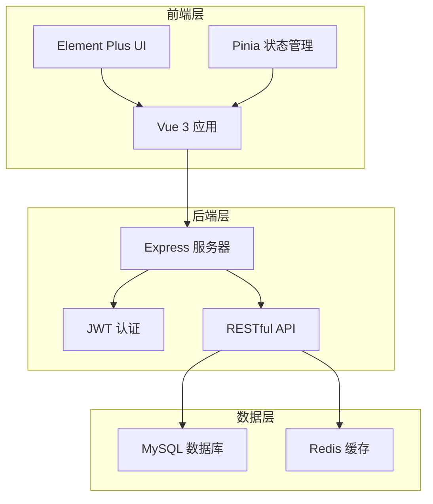
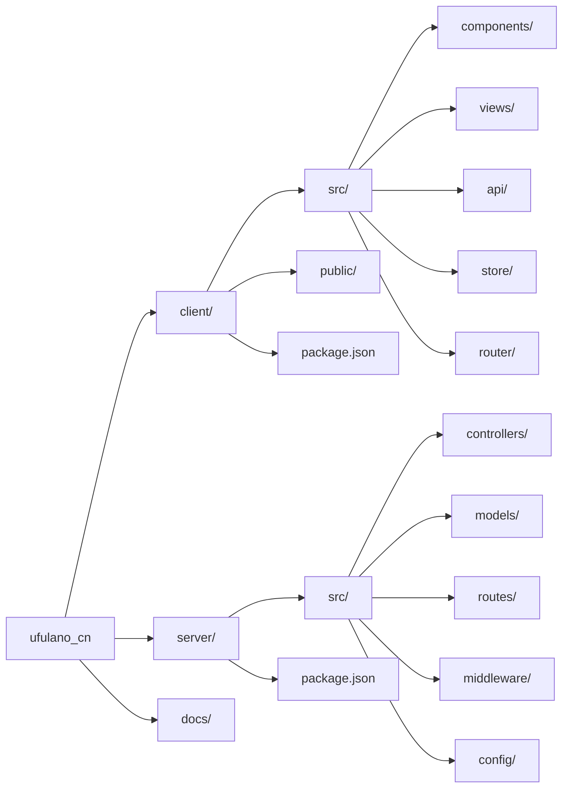
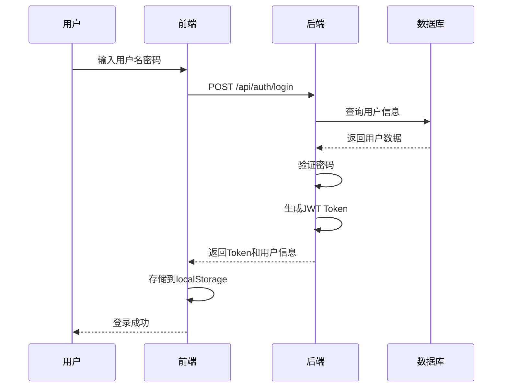
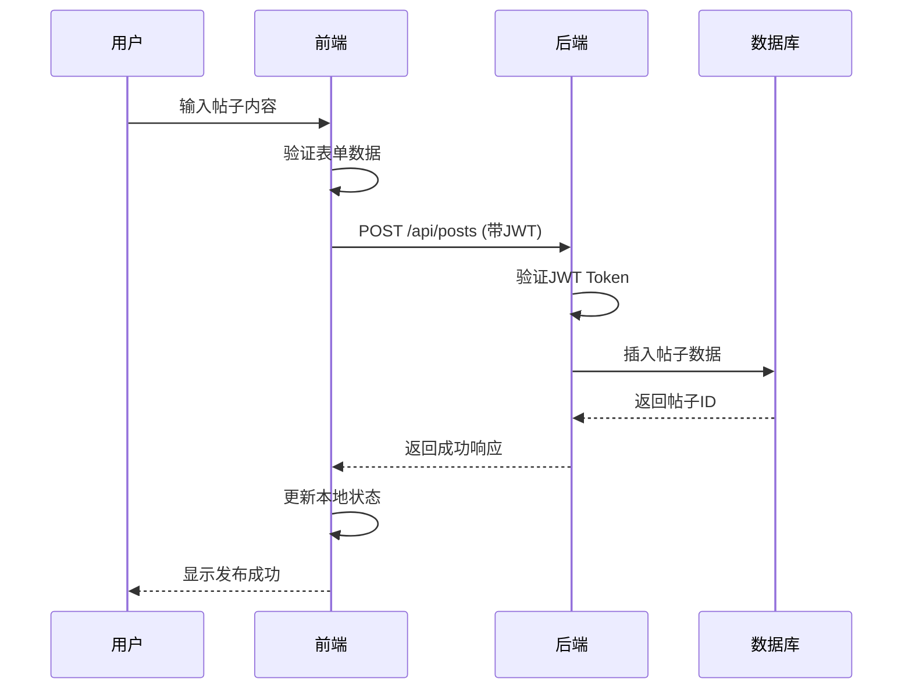
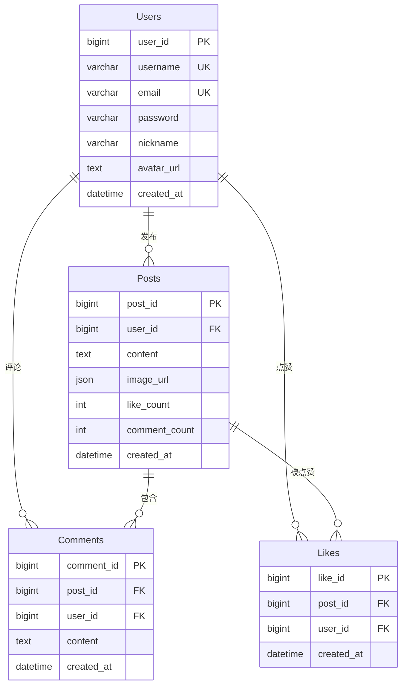
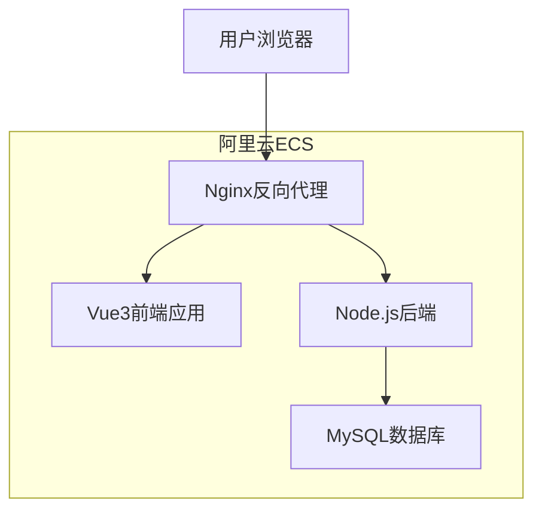

# Ufulano 社交平台

[](https://nodejs.org/)
[](https://vuejs.org/)
[](https://expressjs.com/)
[](https://www.mysql.com/)
[](LICENSE)

一个基于现代Web技术栈开发的社交平台，采用前后端分离架构，实现了用户系统、内容管理、社交互动等核心功能。

## 🚀 快速开始

### 环境要求
- Node.js 18.0+
- MySQL 8.0+
- npm 8.0+

### 安装运行
```bash
# 克隆项目
git clone <repository-url>
cd ufulano_cn

# 安装前端依赖
cd client
npm install

# 安装后端依赖
cd ../server
npm install

# 配置数据库连接
cp src/config/database.example.js src/config/database.js
# 编辑 database.js 文件，填入数据库配置

# 启动后端服务 (端口3000)
npm start

# 启动前端服务 (端口5173)
cd ../client
npm run dev
```

### 访问地址
- 前端应用: http://localhost:5173
- 后端API: http://localhost:3000
- API文档: http://localhost:3000/api-docs

## 📋 功能特性

### 用户系统
- 用户注册/登录
- JWT身份认证
- 个人资料管理
- 头像上传

### 内容管理
- 帖子发布
- 图片上传
- 内容编辑
- 搜索功能

### 社交互动
- 点赞系统
- 评论功能
- 转发功能
- 用户关注

### 界面设计
- 响应式布局
- 现代化UI
- 移动端适配
- 主题切换

## 🏗️ 技术架构

### 系统架构图



### 技术栈

#### 前端
- **Vue 3** - 渐进式JavaScript框架
- **Element Plus** - Vue 3 UI组件库
- **Pinia** - Vue状态管理
- **Vue Router** - 官方路由管理器
- **Axios** - HTTP客户端
- **Vite** - 构建工具

#### 后端
- **Node.js** - JavaScript运行环境
- **Express** - Web应用框架
- **Sequelize** - ORM数据库工具
- **JWT** - 身份认证
- **bcryptjs** - 密码加密
- **Swagger** - API文档

#### 数据库
- **MySQL 8.0** - 关系型数据库
- **Redis** - 内存数据库

## 📊 项目结构



### 目录说明

```
ufulano_cn/
├── client/                 # 前端应用
│   ├── src/
│   │   ├── components/    # Vue组件
│   │   ├── views/         # 页面组件
│   │   ├── api/           # API接口
│   │   ├── store/         # 状态管理
│   │   ├── router/        # 路由配置
│   │   └── utils/         # 工具函数
│   └── package.json
├── server/                # 后端应用
│   ├── src/
│   │   ├── controllers/   # 控制器
│   │   ├── models/        # 数据模型
│   │   ├── routes/        # 路由定义
│   │   ├── middleware/    # 中间件
│   │   └── config/        # 配置文件
│   └── package.json
└── docs/                  # 项目文档
```

## 🔧 核心功能实现

### 用户认证流程



### 帖子发布流程



## 🗄️ 数据库设计

### 核心表结构



## 🚀 部署说明

### 阿里云部署架构



### 部署步骤

1. **服务器准备**
   ```bash
   # 安装Node.js
   curl -fsSL https://deb.nodesource.com/setup_18.x | sudo -E bash -
   sudo apt-get install -y nodejs
   
   # 安装MySQL
   sudo apt install mysql-server -y
   
   # 安装Nginx
   sudo apt install nginx -y
   ```

2. **项目部署**
   ```bash
   # 克隆项目
   git clone <repo-url> /var/www/ufulano_cn
   cd /var/www/ufulano_cn
   
   # 安装依赖
   cd server && npm install
   cd ../client && npm install && npm run build
   ```

3. **配置Nginx**
   ```nginx
   server {
       listen 80;
       server_name your-domain.com;
       
       location / {
           root /var/www/ufulano_cn/client/dist;
           try_files $uri $uri/ /index.html;
       }
       
       location /api/ {
           proxy_pass http://localhost:3000;
           proxy_set_header Host $host;
           proxy_set_header X-Real-IP $remote_addr;
       }
   }
   ```

4. **启动服务**
   ```bash
   # 使用PM2管理进程
   npm install -g pm2
   pm2 start server/src/app.js --name ufulano-server
   pm2 save
   pm2 startup
   ```

## 📚 API文档

### 认证接口
- `POST /api/auth/login` - 用户登录
- `POST /api/auth/register` - 用户注册

### 帖子接口
- `GET /api/posts` - 获取帖子列表
- `POST /api/posts` - 创建帖子
- `GET /api/posts/:id` - 获取帖子详情

### 用户接口
- `GET /api/users/:id` - 获取用户信息
- `PUT /api/users/profile` - 更新用户信息

### 互动接口
- `POST /api/likes/:postId` - 点赞/取消点赞
- `POST /api/comments` - 发布评论
- `POST /api/reposts` - 转发帖子

详细API文档请查看 [API_DOCUMENTATION.md](./API_DOCUMENTATION.md)

## 🛠️ 开发指南

### 前端开发
```bash
cd client
npm run dev          # 启动开发服务器
npm run build        # 构建生产版本
npm run lint         # 代码检查
```

### 后端开发
```bash
cd server
npm start            # 启动服务器
npm run dev          # 开发模式
node test-db.js      # 测试数据库连接
```

### 数据库操作
```bash
# 检查数据库连接
node server/test-db.js

# 检查表结构
node server/check-table.js
```

## 📈 性能优化

### 前端优化
- 图片懒加载
- 虚拟滚动
- 组件缓存
- 代码分割

### 后端优化
- 数据库索引
- 查询优化
- 缓存策略
- 分页查询

### 部署优化
- Nginx反向代理
- 静态资源缓存
- Gzip压缩
- CDN加速

## 🔒 安全措施

- JWT Token认证
- 密码加密存储
- SQL注入防护
- XSS防护
- CORS配置
- 请求验证

## 📝 项目文档

- [项目设计文档](./PROJECT_DESIGN.md) - 完整的项目架构和技术栈说明
- [API文档](./API_DOCUMENTATION.md) - 详细的API接口文档
- [项目开发日志](./PROJECT_LOG.md) - 开发过程记录和问题解决
- [部署检查清单](./DEPLOYMENT_CHECKLIST.md) - 部署步骤和注意事项
- [项目展示](./PROJECT_SHOWCASE.md) - 项目功能展示和技术亮点

## 🤝 贡献指南

1. Fork 本仓库
2. 创建特性分支 (`git checkout -b feature/AmazingFeature`)
3. 提交更改 (`git commit -m 'feat: add amazing feature'`)
4. 推送到分支 (`git push origin feature/AmazingFeature`)
5. 开启 Pull Request

## 📄 许可证

本项目采用 MIT 许可证 - 查看 [LICENSE](LICENSE) 文件了解详情。

## 📞 联系方式

- 项目地址: [GitHub Repository](https://github.com/yourusername/ufulano_cn)
- 问题反馈: [Issues](https://github.com/yourusername/ufulano_cn/issues)

---

⭐️ 如果这个项目对你有帮助，请给它一个 Star！